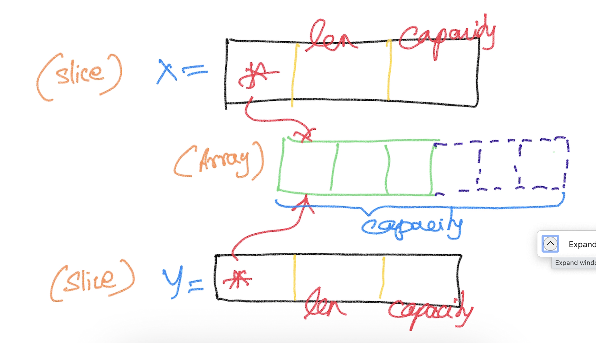

# Collections
## Array
- fixed size typed collection
## Slice
- Varying size typed collection

- 3 word object with the following
    - a pointer to an underlying array
    - len (the # of values that is accessible from the underlying array using the slice)
    - capacity (how much memory is allocated with initialized + uninitialized)
- use **make()** function to pre-allocate memory

## Map
- Typed collection of key/value pairs