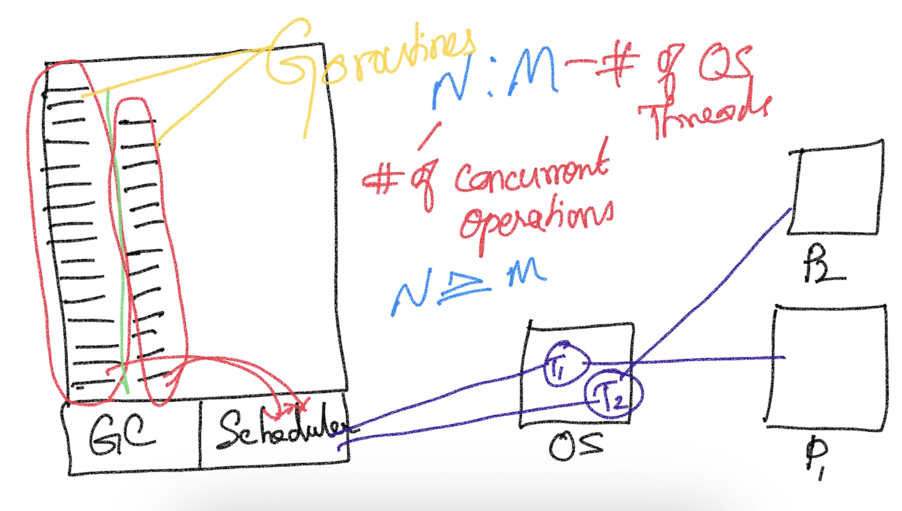
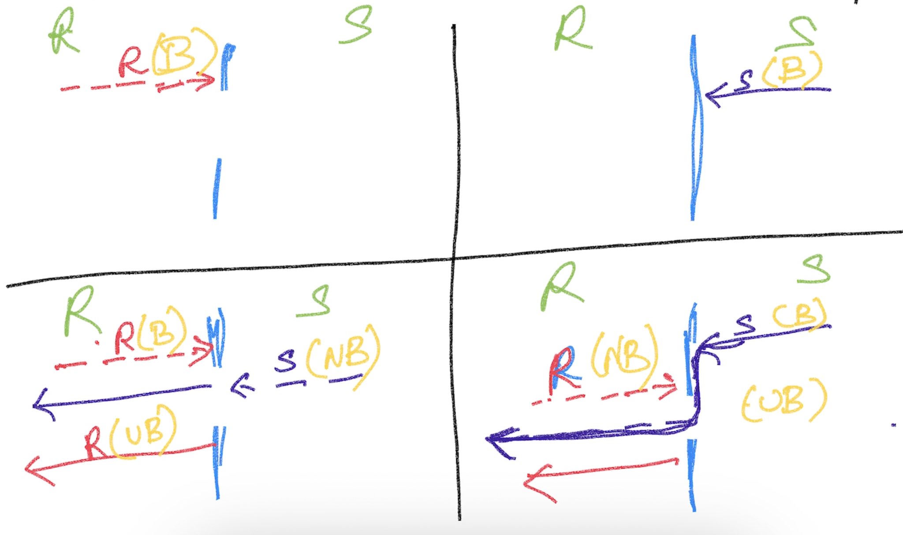

# Concurrency #



## Language Features
- go keyword
- channel data type
- channel operator (<-)
- "range" construct
- "select case" construct

## Api Support
- sync package
- sync/atomic package

## Notes
- The scheduled function will be picked up for execution ONLY when the current function execution is blocked for any reason

## To detect race conditions
- go run --race <program.go>
- go build --race <program.go>

## Channel
- Data type to assist in enabling communication between goroutines
    ### Declaration
    ```
        var ch chan int
    ```
    ### Instantiation
    ```
        ch = make(chan int)
    ```
    ### Channel Operations (using <- operator)
    -Send
    ```
        ch <- 100
    ```
    -Receive
    ```
        data := <-ch
    ```

## Channel Operations
- Receive Operation
    - A Receive operation is ALWAYS a blocking operation
- Send Operation
    - A send operation can succeed (unblocked) ONLY if a receive operation is already initiated (Conditions Apply)



